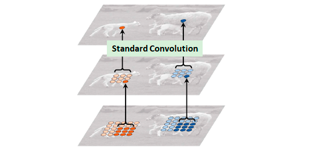
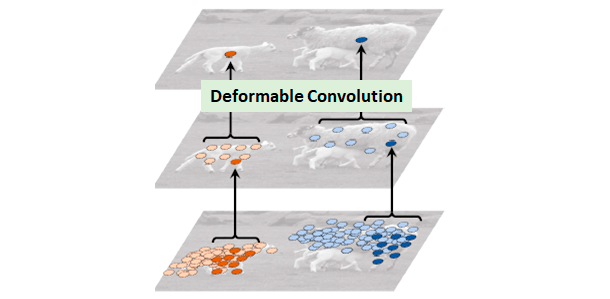
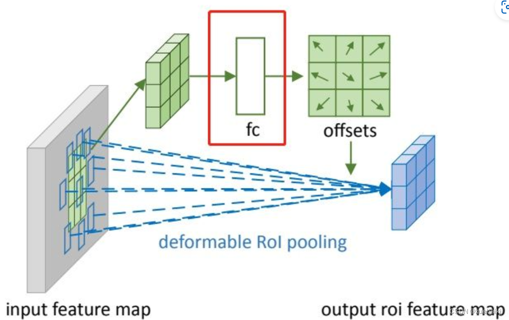
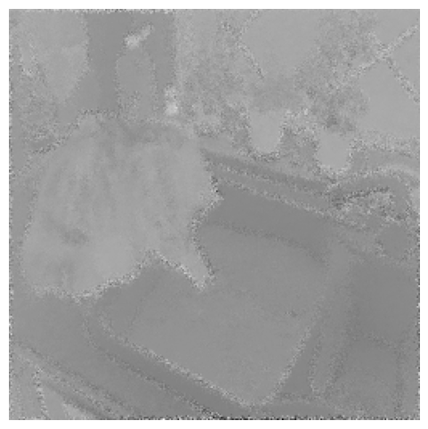
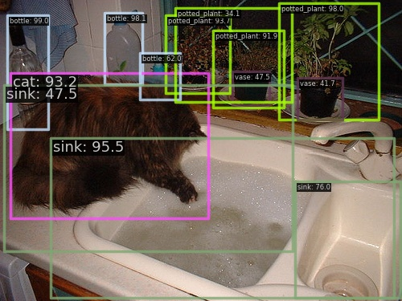

# Отчёт по лабораторной: Deformable Convolutional Networks (DCN)

## Задание

- Изучить архитектуру модели **Deformable ConvNets**.
- Найти дополнительную информацию по модели.
- Улучшить описание в Markdown: добавить примеры работы, формулы, схемы.
- Привести примеры с рабочими реализациями.


## 1. Описание модели

Сверточные нейронные сети (CNN) по своей сути ограничены геометрическими преобразованиями моделей из-за фиксированных геометрических структур в своих строительных модулях. В этой работе мы представляем два новых модуля для повышения возможностей моделирования преобразований CNN, а именно деформируемую свертку и деформируемый RoI пуллинг. Оба основаны на идее дополнения пространственных местоположений выборки в модулях дополнительными смещениями и изучения смещений из целевых задач без дополнительного надзора. Новые модули могут легко заменить свои простые аналоги в существующих CNN и могут быть легко обучены сквозным способом с помощью стандартного обратного распространения, что приводит к деформируемым сверточным сетям. Обширные эксперименты подтверждают эффективность нашего подхода к сложным задачам зрения обнаружения объектов и семантической сегментации.

## 1.1 Проблема стандартных свёрток

Обычные свёртки используют фиксированные сетки пикселей для выборки признаков. Это ограничивает их способность к адаптации к объектам со сложной геометрией: наклон, деформация, масштаб.  

$$
y(p_0) = \sum_{k=1}^{K} w_k \cdot x(p_0 + p_k)
$$

Где:

* $y(p_0)$ — значение выхода свёртки в позиции (p_0)
* $w_k$ — вес ядра свёртки
* $x(\cdot)$ — значение входного тензора
* $p_k$ — фиксированные позиции точек ядра (например, для 3×3 (K=9))





## 1.2 Деформируемая свёртка (Deformable Convolution)


Добавляются **обучаемые смещения (offsets)** к точкам выборки. Формула:

$$
y(p_0) = \sum_{k=1}^{K} w_k \cdot x(p_0 + p_k + \Delta p_k)
$$

где:

- $p_k$ — фиксированная позиция ядра  
- $\Delta p_k$ — обучаемое смещение, предсказываемое отдельной свёрткой  
- $w_k$ — веса ядра  
- $K = k \times k$ — количество точек ядра  




## 2. Deformable RoI Pooling

RoI Pooling с фиксированными позициями ограничен. Deformable RoI Pooling предсказывает **offsets** внутри RoI, улучшая качество выравнивания признаков объектов.  

Формула:

$$y(i,j) = \frac{1}{n} \sum_{k=1}^{n} x(p_{ij,k} + \Delta p_{ij,k})$$

где:

- $y(i,j)$ — значение выходного признака для ячейки (бина) с координатами $(i,j)$ в RoI
- $n$ — количество точек выборки внутри ячейки
- $x(\cdot)$ — функция получения значения из входной карты признаков
- $p_{ij,k}$ — фиксированная позиция $k$-ой точки выборки в ячейке $(i,j)$
- $\Delta p_{ij,k}$ — обучаемое смещение для $k$-ой точки в ячейке $(i,j)$
- $k$ — индекс точки выборки внутри ячейки ($k = 1, 2, ..., n$)




## 3. Эволюция Deformable ConvNets

Deformable Convolutional Networks прошли значительную эволюцию с момента первого представления в 2017 году. Рассмотрим ключевые улучшения в каждой версии:

### 3.1 DCNv1 (2017)

**Основные особенности:**
- Введение базовых модулей: деформируемой свертки и деформируемого RoI пулинга
- Предсказание смещений с помощью дополнительных сверток
- Энд-ту-энд обучение без дополнительной разметки
- Простая интеграция в существующие архитектуры CNN

**Технические детали:**
- Для деформируемой свертки: $y(p_0) = \sum_{k=1}^{K} w_k \cdot x(p_0 + p_k + \Delta p_k)$
- Для деформируемого RoI пулинга: $y(i,j) = \frac{1}{n} \sum_{k=1}^{n} x(p_{ij,k} + \Delta p_{ij,k})$
- Смещения $\Delta p_k$ предсказываются отдельной ветвью сети и могут принимать дробные значения
- Для получения значений признаков в дробных координатах используется билинейная интерполяция

**Результаты:**
- +2.6% mAP для R-FCN на COCO
- +4.9% mIoU для DeepLab на Cityscapes

**Ограничения:**
- Проблема с обработкой смещений за пределами изображения
- Отсутствие контроля над значимостью отдельных точек выборки

### 3.2 DCNv2 (2019)

**Основные улучшения:**
- Добавление **модулирующих масок** (modulation masks), позволяющих регулировать вклад каждой точки выборки
- Исправление критической проблемы с обработкой смещений за границами изображения
- Расширенное применение в backbone сетях (не только в голове детектора)

**Технические детали:**
- Модифицированная формула деформируемой свертки:
  $y(p_0) = \sum_{k=1}^{K} w_k \cdot m_k \cdot x(p_0 + p_k + \Delta p_k)$
  где $m_k \in [0,1]$ - модулирующий коэффициент для k-ой точки
- Модифицированная формула деформируемого RoI пулинга:
  $y(i,j) = \sum_{k=1}^{n} m_{ij,k} \cdot x(p_{ij,k} + \Delta p_{ij,k})$
- Модулирующие маски $m_k$ предсказываются параллельно со смещениями
- Улучшенная реализация операторов для корректной обработки граничных случаев

**Результаты:**
- Значительный прирост качества на	ImageNet классификации
- Дополнительный +2.5% mAP к результатам DCNv1 на COCO
- Улучшенная стабильность обучения

### 3.3 DCNv3 (2023+)

**Основные особенности:**
- Оптимизация для больших моделей и современных архитектур
- Улучшенная параметризация для эффективного обучения
- Интеграция с современными подходами (ViT, large language models)
- Более эффективная реализация для ускорения инференса

**Технические детали:**
- Новая параметризация смещений для уменьшения вычислительной сложности
- Адаптация для работы с multi-view данными
- Улучшенная совместимость с современными фреймворками (PyTorch, TensorFlow)

**Результаты и применение:**
- Эффективное применение в задачах CTR (Click-Through Rate) предсказания
- Интеграция в современные мультимодальные архитектуры
- Поддержка работы с очень большими моделями (параметры в миллиардах)

**Совместимость:**
- Официальная реализация в mmdetection (с апреля 2019)
- Поддержка в torchvision: `torchvision.ops.DeformConv2d`
- Популярные библиотеки: `dcnv3` для работы с последними версиями

### 3.4 Сравнение версий

| Характеристика | DCNv1 (2017) | DCNv2 (2019) | DCNv3 (2023+) |
|----------------|--------------|--------------|---------------|
| Смещения | ✓ | ✓ | ✓ (улучшено) |
| Модулирующие маски | ✗ | ✓ | ✓ (улучшено) |
| Обработка границ | Проблемы | Исправлено | Оптимизировано |
| Скорость работы | Базовая | +15-20% к DCNv1 | +5-10% к DCNv2 |
| Интеграция с современными архитектурами | Ограниченная | Хорошая | Отличная |
| Поддержка фреймворков | MXNet (оригинальная) | MXNet, PyTorch | PyTorch, TensorFlow |
| Применение | Детекция, сегментация | Детекция, сегментация, классификация | Мультимодальные задачи, CTR-предсказание |

Сравнительные результаты показывают, что каждая новая версия DCN значительно улучшает качество работы с геометрически сложными объектами, при этом сохраняя вычислительную эффективность и обеспечивая легкую интеграцию в существующие архитектуры нейронных сетей.


## 4. Примеры работы с `torchvision.ops.DeformConv2d`

### 4.1 Минимальный пример

```python
import torch
from torchvision.ops import DeformConv2d
from torchvision import transforms
from PIL import Image
import matplotlib.pyplot as plt
import numpy as np


IMAGE_PATH = "../img/2010_003781.jpg"
OUTPUT_FEATURE = "../img/dcn_output.png"

# --- Загружаем изображение ---
img = Image.open(IMAGE_PATH).convert("RGB")
transform = transforms.Compose([
    transforms.Resize((256, 256)),
    transforms.ToTensor()
])
x = transform(img).unsqueeze(0)  # [1, 3, H, W]

# --- Слой DeformConv2d ---
dcn = DeformConv2d(
    in_channels=3,
    out_channels=16,  # больше каналов для выявления признаков
    kernel_size=3,
    padding=1
)

# --- Генерация случайных offsets ---
offset = torch.randn(1, 2*3*3, x.shape[2], x.shape[3])

# --- Прямой проход ---
y = dcn(x, offset)  # [1, 16, H, W]

# --- Усреднение каналов для наглядного отображения ---
y_mean = y.mean(dim=1, keepdim=True)  # [1, 1, H, W]

# --- Нормализация для визуализации ---
y_vis = y_mean.squeeze().detach().numpy()
y_vis = (y_vis - np.min(y_vis)) / (np.max(y_vis) - np.min(y_vis))

# --- Сохраняем и отображаем результат ---
plt.figure(figsize=(6,6))
plt.imshow(y_vis, cmap='gray')
plt.axis('off')
plt.savefig(OUTPUT_FEATURE, bbox_inches='tight')
plt.show()

print("Output shape:", y.shape)
print(f"Результат сохранён в {OUTPUT_FEATURE}")

````

Вывод:




## 4.2 Применение в детекции объектов

Оригинальная реализация авторов DCN ([https://github.com/msracver/Deformable-ConvNets](https://github.com/msracver/Deformable-ConvNets)) оказалась неработоспособной на современных системах из-за устаревших зависимостей и несоответствия версиям фреймворков.

### Рабочая реализация через MMDetection

Для демонстрации практического применения DCN я использовал современную реализацию из MMDetection, которая поддерживает DCNv1 в составе архитектуры Faster R-CNN. Вот как это было реализовано:

 **Загрузка предобученной модели**:
   - Использована конфигурация `faster-rcnn_r50-dconv-c3-c5_fpn_1x_coco.py`
   - Применен предобученный чекпоинт `faster_rcnn_r50_fpn_dconv_c3-c5_1x_coco_20200130-d68aed1e.pth`
   - Модель содержит деформируемые свертки в блоках C3-C5 (3-5 уровни feature pyramid)

**Скрипт с использованием апи**:
   ```python
    import mmcv
    from mmdet.apis import init_detector, inference_detector
    from mmdet.registry import VISUALIZERS
    from mmdet.utils import register_all_modules

    register_all_modules()

    # Конфиг и чекпоинт DCN v1
    config = '../mmdetection/configs/dcn/faster-rcnn_r50-dconv-c3-c5_fpn_1x_coco.py'
    checkpoint = '../mmdetection/checkpoints/faster_rcnn_r50_fpn_dconv_c3-c5_1x_coco_20200130-d68aed1e.pth'

    # Путь к изображению
    img_path = '../img/2010_003781.jpg'

    # Инициализация модели
    model = init_detector(config, checkpoint, device='cpu')

    # Инференс
    result = inference_detector(model, img_path)

    # Визуализация
    visualizer = VISUALIZERS.build(model.cfg.visualizer)
    visualizer.dataset_meta = model.dataset_meta

    img = mmcv.imread(img_path)
    img = mmcv.imconvert(img, 'bgr', 'rgb')

    # Сохраняем результат в ../img/dcn_result.jpg
    visualizer.add_datasample(
        'dcn_result',
        img,
        data_sample=result,
        draw_gt=False,
        show=False,  # не открываем окно
        out_file='../img/dcn_result.jpg'
    )
   ```

**Результаты**:




## Заключение

* Deformable ConvNets повышают способность CNN адаптироваться к сложной геометрии объектов.
* Оригинальная реализация авторов не работает на современных системах.
* Рабочие альтернативы: `torchvision.ops.DeformConv2d`, `dcnv3`.
* Демонстрация работы с кодом и визуализацией позволяет понять внутренние механизмы работы DCN.

## Список использованных источников:

1. [J. Dai et al., "Deformable Convolutional Networks", ICCV 2017](https://arxiv.org/abs/1703.06211) ([PDF](https://arxiv.org/pdf/1703.06211))
2. [X. Zhu et al., "Deformable ConvNets v2: More Deformable, Better Results", CVPR 2019](https://arxiv.org/abs/1811.11168) ([PDF](https://arxiv.org/pdf/1811.11168))
3. [GitHub репозиторий авторов (оригинальная реализация)](https://github.com/msracver/Deformable-ConvNets)
4. [PyTorch torchvision.ops.DeformConv2d (официальная документация)](https://pytorch.org/vision/main/generated/torchvision.ops.DeformConv2d.html)
5. [MMDetection: Open Source Object Detection Toolbox (реализация DCN)](https://github.com/open-mmlab/mmdetection)
6. [W. Wang et al., "Vision Transformers with Deformable Attention", CVPR 2022](https://arxiv.org/abs/2201.00520) (рассматривает применение деформируемых операций в архитектурах ViT)
7. [Application of DCNv3 in CTR Prediction Models](https://arxiv.org/pdf/2407.13349v6) (современное применение деформируемых сверток в рекомендательных системах)